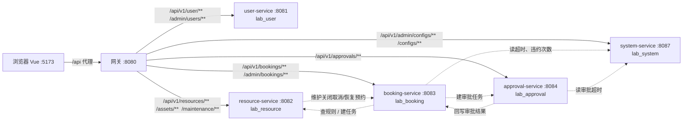
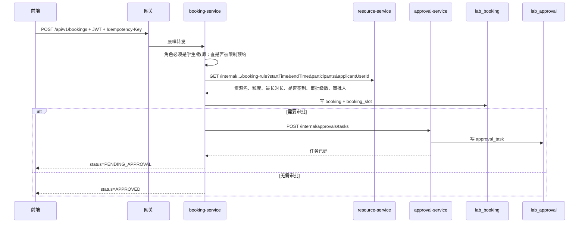

# 实验室设备预约系统数据流说明

所有接口都包在同一层信封里。前端用 axios，开发时 `/api` 被代理到网关 `8080`，登录后每次请求自动带 JWT。

## 统一约定

成功：

```json
{
  "code": "SUCCESS",
  "message": "操作成功",
  "data": { },
  "requestId": "uuid"
}
```

失败：`code` 为业务码（如 `BOOKING_CONFLICT`），`data` 为 `null`，`message` 已是中文。前端读 `response.data.message` 做提示；`401` 会清 token 并回到登录。

浏览器 → 后端的公共头：

| 头 | 何时有 | 作用 |
|---|---|---|
| `Authorization: Bearer <accessToken>` | 登录后所有请求 | 各服务自己验签，取出 `userId / roles` |
| `Idempotency-Key` | 创建预约（取消也会带，后端创建才强制） | 同一 Key 重复提交返回同一条预约 |
| `Content-Type: application/json` | 有 body 时 | JSON |

网关只按路径转发，不改 body。服务之间另走 `/api/v1/internal/**`，带 `X-Internal-Service-Token`，浏览器打不到。

总体结构：



| 库 | 谁写 | 主要内容 |
|---|---|---|
| `lab_user` | user-service | 账号、角色、刷新令牌 |
| `lab_resource` | resource-service | 资源、开放时间、维护关闭、资产、报修 |
| `lab_booking` | booking-service | 预约、时间片、违约、限制 |
| `lab_approval` | approval-service | 审批任务、审批记录 |
| `lab_system` | system-service | 业务参数、管理员操作日志 |

---

## 1. 登录

**前端传** `POST /api/v1/user/login`

```json
{ "username": "S20260001", "password": "12345678" }
```

**后端** user-service 查 `lab_user.user`，校验密码和 `ACTIVE`，写 `lastLoginAt`，签发 JWT。

**回给前端** `data`：

```json
{
  "accessToken": "eyJ...",
  "refreshToken": "...",
  "expiresIn": 7200,
  "user": {
    "id": 1,
    "username": "S20260001",
    "realName": "张三",
    "roles": ["STUDENT"]
  }
}
```

前端把 `accessToken` 存 `localStorage`，`user` 用来切页面：系统管理员进系统管理，实验室管理员进实验室管理，学生/教师进预约工作台。

随后立刻 `GET /api/v1/user/me`（无 body），回来多 `employeeNo / email / phone`。再 `GET /api/v1/configs/runtime`，回来签到窗口等数字，给签到按钮用：

```json
{
  "checkinBeforeMinutes": 15,
  "checkinAfterMinutes": 30,
  "approvalTimeoutMinutes": 1440,
  "violationMaxCount": 3,
  "violationRestrictionDays": 30
}
```

---

## 2. 学生/教师进入工作台（拉列表）

登录成功后并行请求（都无 body，靠 JWT）：

| 前端调用 | 后端 | 返回的 `data` |
|---|---|---|
| `GET /api/v1/resources` | resource-service | 资源数组：`id, typeId, name, location, capacity, needCheckin, maxDurationMinutes, slotMinutes, approvalLevelOverride, imageUrl, description, status` |
| `GET /api/v1/resource-types` | resource-service | 类别：`id, name, defaultApprovalLevel, enabled` |
| `GET /api/v1/bookings/my` | booking-service | 当前用户预约数组（见下） |
| `GET /api/v1/assets/types` | resource-service | 公开设备种类，给筛选用 |
| 教师再加 `GET /api/v1/approvals/mine` | approval-service | 待我审的任务数组 |

一条预约大致是：

```json
{
  "id": 17,
  "bookingNo": "BK...",
  "userId": 1,
  "resourceId": 1,
  "resourceNameSnapshot": "材料分析实验室",
  "applicantNameSnapshot": "张三",
  "startTime": "2026-09-22T10:00:00",
  "endTime": "2026-09-22T10:30:00",
  "purpose": "课程实验",
  "participants": 1,
  "status": "PENDING_APPROVAL",
  "approvalDeadline": "2026-09-02T10:00:00",
  "needCheckinSnapshot": true,
  "rejectReason": null
}
```

状态：`PENDING_APPROVAL / APPROVED / REJECTED / CANCELED / CHECKED_IN / COMPLETED / NO_SHOW / EXPIRED`。

实验室管理员登录后**不拉个人预约**，只拉 `GET /api/v1/resources` 进管理台。系统管理员连资源列表也不拉，只进用户/配置/日志。

---

## 3. 选时段：日历 + 占用

打开某个资源时，前端对**每个资源**并行打两个接口（未来 30 天）：

**① 开放时间与关闭**  
`GET /api/v1/resources/{id}/calendar?start=2026-09-01&end=2026-10-01`

resource-service 读排班、未取消的维护关闭，返回：

```json
{
  "resource": { "id": 1, "name": "材料分析实验室", "...": "..." },
  "days": [
    {
      "date": "2026-09-22",
      "open": [
        { "weekday": 1, "openTime": "09:00:00", "closeTime": "17:00:00", "slotMinutes": 30, "maxDurationMinutes": 120 }
      ],
      "closures": [
        { "id": 3, "startTime": "2026-09-22T14:00:00", "endTime": "2026-09-22T16:00:00", "reason": "校准", "status": "PLANNED" }
      ]
    }
  ]
}
```

**② 已被预约的区间**  
`GET /api/v1/bookings/resource/{id}/occupied?start=2026-09-01T00:00:00&end=2026-10-01T23:59:59`

booking-service 查状态为待审/已通过/使用中的预约，只回时间：

```json
[{ "startTime": "2026-09-22T10:00:00", "endTime": "2026-09-22T10:30:00" }]
```

前端在浏览器里把「开放窗口 − 关闭 − 占用」切成格子。不可用格子不会提交。

---

## 4. 提交预约（最完整的一条跨服务链）

用户勾连续格子后，前端组 body（表单里还有展示用字段，**后端只认下面 5 个**）：

```http
POST /api/v1/bookings
Idempotency-Key: <uuid>
Authorization: Bearer ...

{
  "resourceId": 1,
  "startTime": "2026-09-22T10:00:00",
  "endTime": "2026-09-22T10:30:00",
  "purpose": "课程实验",
  "participants": 1
}
```

`resourceName、capacity、slotMinutes、needCheckin、approvalLevel` 前端也会塞进 JSON，后端 `Create` 记录直接忽略。

后端内部顺序：



**booking-service → resource-service** 内部查询（前端不可见）返回类似：

```json
{
  "resourceName": "材料分析实验室",
  "resourceTypeId": 1,
  "capacity": 12,
  "slotMinutes": 30,
  "maxDurationMinutes": 120,
  "needCheckin": true,
  "approvalLevel": 1,
  "approverUserId": 3,
  "approverRole": "TEACHER"
}
```

这里会校验：是否同一天、是否已开始、是否在开放时间内、是否落在粒度上、是否维护关闭、人数是否超容量。失败则整单失败，前端看到 `RESOURCE_CLOSED` / `OUTSIDE_OPEN_HOURS` / `INVALID_SLOT` 等中文。

**booking-service → approval-service** 内部建任务，写入申请人、资源、时段、`level=1`、`totalLevels`、指派的教师或实验室管理员角色。

**回给前端**就是上面那条 `Booking`。同一 `Idempotency-Key` 再提交，直接返回已有记录，不新建。

冲突时 `409`，`code=BOOKING_CONFLICT`。被限制预约时 `403`，`USER_RESTRICTED`。管理员账号会 `FORBIDDEN`（管理员不用个人预约）。

---

## 5. 取消、签到

**取消** `POST /api/v1/bookings/{id}/cancel`，body `{}`。  
仅本人、且状态为待审/已通过、且尚未开始。  
返回更新后的预约（`status=CANCELED`）。若原是待审，提交成功后异步关审批任务。

**签到** `POST /api/v1/bookings/{id}/checkin`，body `{}`。  
必须已通过，且当前时间在「开始前 N 分钟～开始后 M 分钟」（N/M 来自 runtime 配置）。  
成功：`status=CHECKED_IN`，带 `checkinAt`。

定时任务（前端不调）：到期未签到 → `NO_SHOW` + 一条 `OPEN` 违约；审批超时 → `EXPIRED`。

---

## 6. 审批

教师/实验室管理员：

`GET /api/v1/approvals/mine` → 任务列表，例如：

```json
{
  "id": 8,
  "bookingId": 17,
  "applicantUserId": 1,
  "applicantName": "张三",
  "resourceId": 1,
  "resourceName": "材料分析实验室",
  "startTime": "2026-09-22T10:00:00",
  "endTime": "2026-09-22T10:30:00",
  "level": 1,
  "totalLevels": 2,
  "approverRole": "TEACHER",
  "status": "PENDING",
  "deadline": "2026-09-02T10:00:00"
}
```

**通过** `POST /api/v1/approvals/{id}/approve`，body `{}`。  
**驳回** `POST /api/v1/approvals/{id}/reject`，body `{ "comment": "设备当天保养" }`（必填）。

approval-service 再调 booking-service 内部：

`POST /api/v1/internal/bookings/{bookingId}/approval-decision`

```json
{ "status": "APPROVED", "comment": "", "level": 1, "totalLevels": 2 }
```

booking 返回当前预约快照（至少 `status`）。若仍是 `PENDING_APPROVAL`，说明还有下一级：booking **重置本级截止时间**，approval 再建实验室管理员任务。末级通过则预约变 `APPROVED`。驳回则 `REJECTED`，`rejectReason` 给学生看。

前端再 `load()` 刷新「我的预约 / 待审批」。

---

## 7. 实验室管理员：资源与维护关闭

进入管理台并行：

- `GET /api/v1/resources`
- `GET /api/v1/admin/resource-types`
- `GET /api/v1/admin/bookings` → `{ items: [预约...], total }`
- `GET /api/v1/approvals/mine`
- `GET /api/v1/admin/assets`、`/admin/assets/categories`
- `GET /api/v1/admin/maintenance/tickets`
- `GET /api/v1/admin/users/teachers` → `{ items: [{id, username, employeeNo, realName}] }`
- `GET /api/v1/admin/violations`

**保存资源** `POST` 或 `PUT /api/v1/admin/resources[/{id}]`：

```json
{
  "typeId": 1,
  "name": "材料分析实验室",
  "location": "A201",
  "capacity": 12,
  "description": "...",
  "imageUrl": "https://...",
  "maxDurationMinutes": 120,
  "needCheckin": true,
  "approvalLevelOverride": 1
}
```

`approvalLevelOverride` 空表示跟类别。返回完整 `Resource`。

点开某资源再拉：

- `GET .../schedules` → `[{ weekday, openTime, closeTime, slotMinutes, maxDurationMinutes }]`
- `GET .../closures` → 未取消的关闭
- `GET .../managers` → 资源负责人

保存排班：`PUT .../schedules`，数组同上（前端把时间补成 `09:00:00`）。

**添加关闭** `POST /api/v1/admin/resources/{id}/closures`

```json
{ "startTime": "2026-09-22T14:00:00", "endTime": "2026-09-22T16:00:00", "reason": "设备校准" }
```

resource-service 先写入关闭，再内部 `POST /internal/bookings/close-for-maintenance`，body 为 `resourceId, startTime, endTime, reason`。booking 取消重叠的待审/已通过预约。  
**回前端** `{ closure: {...}, cancelledCount: 2 }`。预约服务失败则删除刚写入的关闭，前端看到「预约服务暂时不可用」。

**取消关闭** `POST .../closures/{id}/cancel`，无 body。内部先 `restore-for-maintenance`，再标关闭为取消。  
**回前端** `{ closure: {...}, restoredCount: 1 }`。

---

## 8. 违约

`GET /api/v1/admin/violations` → `{ items: [{ id, bookingId, userId, applicantName, resourceName, bookingNo, startTime, violationType, status, comment, createdAt, processedAt }] }`

确认：`PUT /api/v1/admin/violations/{id}` `{ "status": "CONFIRMED" }`  
撤销：`{ "status": "DISMISSED", "comment": "已现场使用" }`（撤销必填原因）

未签到当时只插 `OPEN`，不限制预约。确认后才按 `CONFIRMED` 计数，够次数才写限制。返回更新后的违约记录。

---

## 9. 系统管理员

| 操作 | 请求 | 返回 |
|---|---|---|
| 用户列表 | `GET /api/v1/admin/users` | `{ items: [{ id, username, realName, email(脱敏), phone(脱敏), status, roles[] }], total }` |
| 角色 | `GET /api/v1/admin/roles` | `{ items: [{ id, code, name }], total }` |
| 改状态 | `PUT /admin/users/{id}/status` `{ "status": "DISABLED" }` | 该用户 |
| 改角色 | `PUT /admin/users/{id}/roles` `{ "roles": ["TEACHER"] }` | 该用户 |
| 重置密码 | `POST /admin/users/{id}/reset-password` `{ "password": "至少8位" }` | `{ id, reset: true }` |
| 删除 | `DELETE /admin/users/{id}` | `{ id, deleted: true }` |
| 导入 | `POST /admin/users/import` `{ "csv": "工号,姓名,..." }` | `{ createdCount, skippedCount, failedCount, created[], skipped[], failed[] }` |
| 配置列表 | `GET /admin/configs` | `[{ key, value, type, description }]` |
| 改配置 | `PUT /admin/configs/{key}` `{ "value": "30" }` | `{ key, value }` |
| 日志 | `GET /admin/operation-logs` | `{ items: [{ operationType, targetType, targetId, result, detail, createdAt, ... }] }` |

导入 CSV 角色只能是学生/教师；管理员行进 `failed[]`，`reason` 为「导入只支持学生或教师角色」。

---

## 10. 报修

学生/教师提交 `POST /api/v1/maintenance/tickets`：

```json
{
  "assetId": 12,
  "resourceId": 1,
  "location": "A201",
  "assetClue": "",
  "reportType": "MALFUNCTION",
  "severity": "MEDIUM",
  "description": "显微镜无法对焦"
}
```

`reportType`：`DAMAGE / MALFUNCTION / LOSS / OTHER`。内部报修必选资产；外部可填资源或位置。  
返回工单（`ticketNo, status=REPORTED, ...`）。列表用 `GET /maintenance/tickets/mine`。

管理员处理 `PUT /admin/maintenance/tickets/{id}`，例如：

```json
{ "status": "REPAIRING", "assetId": 12, "assignedTo": "13800000000", "resolution": "更换镜头" }
```

状态机：待受理 → 已受理/维修中 → 待验收 → 关闭，或中途驳回。

---

## 对照：前端以为提交的 vs 后端真正用的

创建预约时前端整个 `bookingForm` 都 POST 出去，但后端只反序列化：

`resourceId, startTime, endTime, purpose, participants`

规则（粒度、是否签到、几级审批、谁来审）全部由 resource-service 当时计算，不信前端带的 `approvalLevel / needCheckin / slotMinutes`。

审批通过前端可以不传 comment；驳回必须 `comment`。违约确认可以不传 comment；撤销必须 `comment`。
